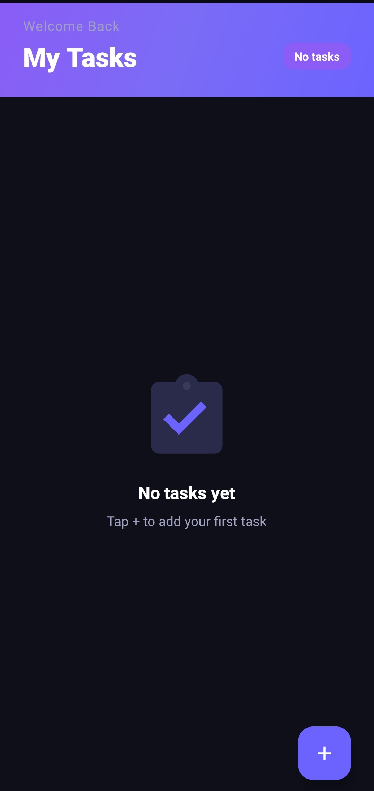
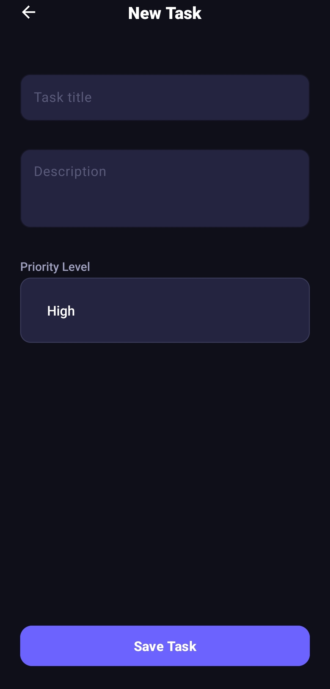
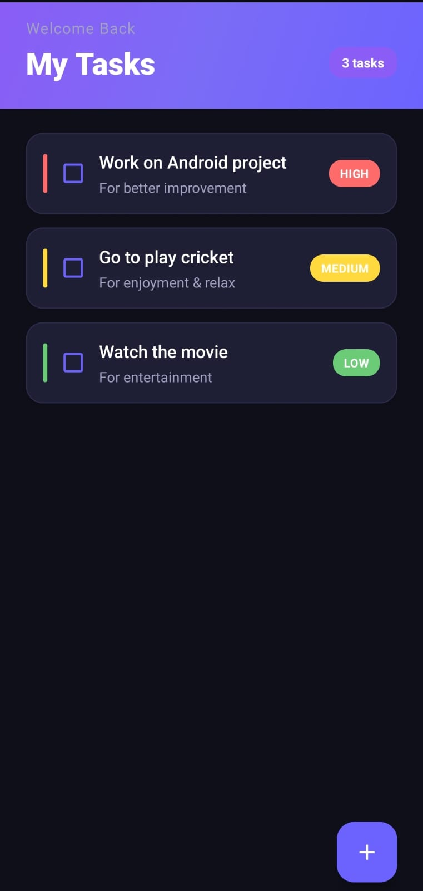
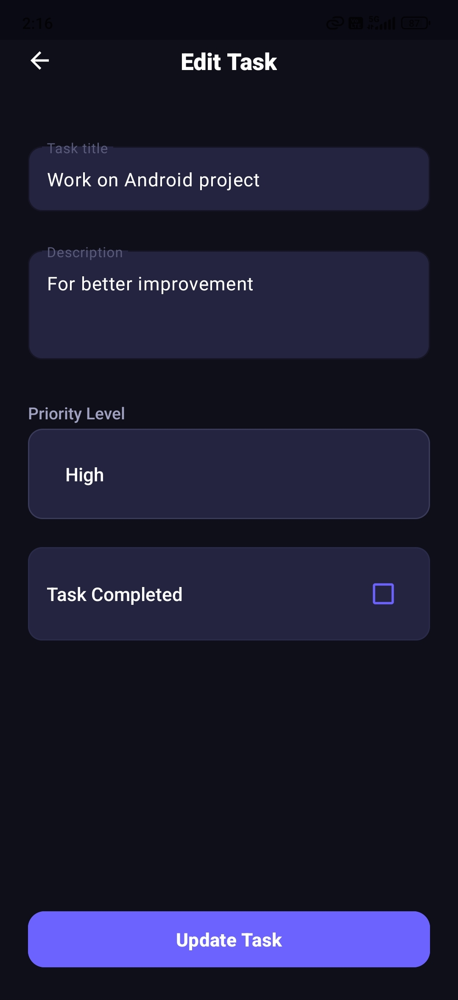

# 📝 TaskActivity — Premium Android Task Manager

[](https://kotlinlang.org)
[](https://developer.android.com)
[](https://developer.android.com/topic/libraries/architecture)
[](https://developer.android.com/training/data-storage/room)

A sleek, premium, and feature-rich Android task management application designed under Material 3 guidelines. **TaskActivity** utilizes local SQLite database persistence, reactive UI components, and clean Model-View-ViewModel (MVVM) architecture to deliver a fast and responsive user experience.

---

## 🎨 UI/UX Features & Redesign Highlights

- **🌌 Deep Space Dark Theme:** A premium, dark slate color palette (`#0F0F1A` / `#1A1A2E`) with glowing electric indigo accents (`#6C63FF` to `#8B5CF6`).
- **🔖 Left-Hand Priority Indicators:** Task items are visually prioritized with dynamic vertical accent strips and colored badges matching task urgency:
  - 🔴 **High Priority:** Coral Red
  - 🟡 **Medium Priority:** Amber Gold
  - 🟢 **Low Priority:** Mint Green
- **📊 Dynamic Task Counter:** A smart task counter on the home screen displays total active tasks, automatically refreshing as items are modified or deleted.
- **✨ Faded Completion States:** Finished tasks display a strike-through title/description and a faded 60% opacity to cleanly separate pending priorities from completed records.
- **🖼️ Empty State Illustration:** A dedicated custom checklist icon and descriptive text appear when there are no tasks, inviting the user to start adding items.
- **🛠️ Material 3 Forms & Input Validation:** Outlined text input fields with dynamic helper messages to prevent blank submissions.
- **🎬 Fluid Page Transitions:** High-fidelity horizontal slide transitions (`enter` and `exit` animation presets) enhance navigation between views.

---

## 📸 App Screenshots

<p align="center">
  
  
</p>

<p align="center">
  
  
</p>

---

## 🏗️ Clean Architecture & Tech Stack

This project follows Android's recommended MVVM framework with a unidirectional data flow:

```
┌─────────────────────────────────────────────────────┐
│                    ACTIVITIES (View)                 │
│  MainActivity ←→ AddTaskActivity / EditTaskActivity  │
│      observes LiveData, handles user interaction     │
└──────────────────────┬──────────────────────────────┘
                       │
              ┌────────▼────────┐
              │   TaskViewModel  │  ← Launches Coroutines
              │ + TaskViewModelFactory │
              └────────┬────────┘
                       │
              ┌────────▼────────┐
              │  TaskRepository  │  ← Clean database abstraction
              └────────┬────────┘
                       │
              ┌────────▼────────┐
              │    TaskDao       │  ← Room queries interface
              └────────┬────────┘
                       │
              ┌────────▼────────┐
              │  TaskDatabase    │  ← SQLite via Room
              │  (table: tasks)  │
              └─────────────────┘
```

- **Kotlin & Coroutines:** Enables non-blocking database transactions on background threads.
- **Room Database:** Clean SQLite abstraction layer for persistent storage.
- **LiveData:** Reactive observation of data changes from the database to update the UI instantly.
- **ViewModel:** Stores UI state in a lifecycle-conscious way, persisting across configuration changes.
- **Material Design 3:** Custom styling overrides for buttons, cards, checkboxes, and status/navigation bars.

---

## 📂 Project Structure

```
com.example.taskactivity/
├── activitties/           # UI Screens (MainActivity, AddTaskActivity, EditTaskActivity)
├── adapter/               # Recycler view lists (MyAdapter)
├── database/              # Room persistence classes (Task, TaskDao, TaskDatabase)
├── repository/            # Local data repository (TaskRepository)
└── viewmodel/             # ViewModels & Viewmodel Factories (TaskViewModel, TaskViewModelFactory)
```

---

## ⚙️ How to Build and Run

### Prerequisites
- **Android Studio** (Koala | 2024.1.1 or newer recommended)
- **JDK 11** or newer
- **Android SDK Platform 35** (`minSdk 24`, `targetSdk 35`)

### Setup Instructions
1. Clone or download this project workspace.
2. Open Android Studio and select **File > Open**, navigating to the project directory root.
3. Allow Android Studio to fetch dependencies and perform a **Gradle Sync**.
4. Set up an Android Virtual Device (AVD) or connect a physical Android device.
5. Click **Run (green play button)** in the top toolbar to build the Debug APK and run the application.
